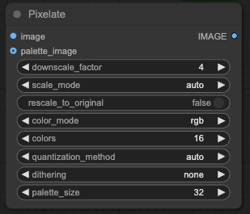

# ComfyUIPixelate
A ComfyUI node implemant function of mrreplicart/sd-webui-pixelart

    
[sd-webui-pixelart](https://github.com/mrreplicart/sd-webui-pixelart) are referenced by many webui users, this node is mean to use it in ComfyUI.